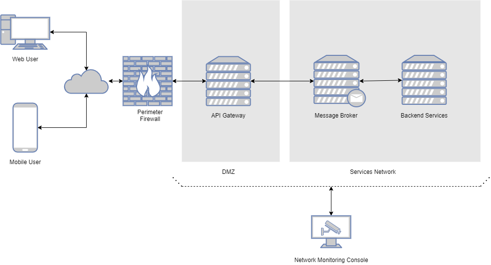

# Experiments in Spring

This project is a personal exploration in a microservices based architecture that uses [Spring Boot](https://spring.io/projects/spring-boot), [RabbitMQ](https://www.rabbitmq.com/), and [MongoDB](https://www.mongodb.com/).

The implemented solution provides an HTTP accessible [RESTful API](https://blog.octo.com/en/design-a-rest-api/) gateway, and a backend service that is responsible for persistence and management of data records.

# Design Decision



_figure 1. draft system design_

Since the whole goal of this exercise is to explore and demonstrate knowledge of microservices, a message broker based architecture was deemed most fitting. More specifically, the use of RabbitMQ, since it is well supported by the Spring Framework.

The system components include an **API gateway**, a **backend service**, a **persistence engine**, and a **message broker**.

The **API gateway** is responsible for providing (and exposing) a set of user management operations (CRUD-like), where there operations is executed on another service, and the result is communicated back in a synchronous [request/reply messaging](https://www.enterpriseintegrationpatterns.com/patterns/messaging/toc.html) manner. Another approach would of have been the use of Remoting over RabbitMQ, but the idea was abandoned in favor of a more loosely coupled design (aka request/reply messaging).

Best practices regarding designing a [RESTful API](https://blog.octo.com/en/design-a-rest-api/) system were both followed and applied, such as versioning, resource collections, searching, sorting, and error handling. Plural form is used for resource collection naming.

**Backend service** was designed to implement the RabbitMQ request/reply listeners, that interacts with the MongoDB database, using the Spring Data MongoDB (repository pattern). Also, the use of UUID was favored, due to its distributed friendly support for unique object id.

Both MongoDB **persistence engine** and RabbitMQ **message broker** are deployed on a **Docker system** with their default settings unchanged.


### Regrets (Wishlist)

**Hexagonal Architecture**: A more Hexagonal Architecture design would be more favored, since it is more suitable for both the requirements of microservices system, and for providing a more testable system.

**Nodes**: For scalability (scale out) and cluster support through multiple nodes launching (each with unique node id).

**Dockerization**: Dockerizing both the api gateway and the backend service will provide great help in support DevOps team in their CI/CD duties, if at all, for simpler deployment to development and production systems. (_hint: this depends on node ids and spring profiles_)

**Unit tests**: Due to lack of time and high ambitions, the unit tests were not written, yet. **;-)**

**Integration Tests**: In addition to unit tests, the parts of the system will need to be tested as a whole using [Cucumber](https://cucumber.io/) based automated testing tools.

**Spring Profiles**: Having two profiles helps in creating system flavors, since in an actual software development scenarios there will exist the need for both a development and a production deployment. In live production we can safely limit logging, enable actuators, and disable the devtools.

**Security**: Applying either rudimentary white-listing to allow certain systems to communicate with the API gatewayo, or the introduction of Spring Security and OAuth. Also, SSL security needs to be enabled, with certificate generation and secure endpoint enforcement.

**Logging**: Logs from all systems should be standardized and sent to a central logging server, to aid with network management systems, for the sake of health and incident monitoring.

# Structure

The solution is provided as a parent folder containing the two Spring Boot projects, and an assortment of images and boilerplate documents.

Files and folders:

```bash
experiments-in-spring
 +---images/
 +---experiments-gateway/
 +---experiments-service/
 +---LICENSE.md
 +---PROJECT.pdf
 \---README.md
```

## User Management API

In this section a detailed api usage is provided, with sufficient information on what endpoints are there, their http operations, path variables, request parameters, body, and expected responses.

Instead of **curl** commands, provided is a [Postam](https://www.postman.com/) collection file that should be imported and utilized for invoking all available methods.

The RESTful API can be accessed with the below provided endpoint address:
````
http://localhost:8080/v1/
````

User management will depend on the following data transfer object:
```java
class User {
  String id;
  String firstName;
  String surname;
  String dateOfBirth;
  String creationDate;
}
```

In summary the supported HTTP operations are as follows:
````
GET /v1/users/
GET /v1/users/{userId}
POST /v1/users
PUT /v1/users/{userId}
DELETE /v1/addresses/{userId}
GET /v1/status
````

Status codes:

HTTP Verb	| CRUD action |	Collection : /users |	Instance : /users/{userId}
----------|-------------|---------------------|------------------------
GET |	READ |	Read a list of users => 200 OK. | Read the detail of a single user => 200 OK.
POST |	CREATE | Create a new user => 201 Created.	| –
PUT	| UPDATE	| –	| Update a current user => 200 OK
DELETE |	DELETE |	–	| Delete a user => 200 OK.


#### Get users (AKA Search)

````
GET /v1/users/?keyword=m&sort=firstName&order=desc
````
Path Variable:<br>
_none_

Request Parameters:<br>
**keyword** - a case-insensitive search keyword, used in a start-with searching algorithm.

**sort** - a single key that designates comma separated field names with which to perform sorting on, of the allowable field names "firstName", "surname", "dateOfBirth", "creationDate". If an illegal or no value is specified, than the default is "creationDate".

**order** - defines the sorting order whether it is _ascending_ or _descending_. Only two values are permitted here, and has to be one of "asc", or "desc". By default "asc" is set.

Request Body:<br>
_none_

Response:
````
[
    {
        "id": "c0390559-0481-416f-a767-6915577e2441",
        "firstName": "Larry",
        "surname": "Fine",
        "dateOfBirth": "1902-10-05T00:00:00.000+00:00",
        "creationDate": "2020-09-05T08:55:54.809+00:00"
    }
]
````

#### Get a specific user

````
GET /v1/users/{userId}
````
Path Variable:<br>
**userId** - A single resource id is defined as a UUID string.

Request Parameters:<br>
_none_

Request Body:<br>
_none_

Response:
````
{
    "id": "c0390559-0481-416f-a767-6915577e2441",
    "firstName": "Larry",
    "surname": "Fine",
    "dateOfBirth": "1902-10-05T00:00:00.000+00:00",
    "creationDate": "2020-09-05T08:55:54.809+00:00"
}
````

#### Add a user
````
POST /v1/users/
````
Path Variable:<br>
_none_

Request Parameters:<br>
_none_

Request Body:
````
{
  "firstName": "Larry",
  "surname": "Fine",
  "dateOfBirth": "1902-10-05"
}
````
Response:<br>
_none_

Note:<br>
_Upon successful addition of a user to the system, a "location" header will be provide an id of the created collection resource._

#### Update a user
````
PUT /v1/users/{userId}
````
Path Variable:<br>
**userId** - A single resource id is defined as a UUID string.

Request Parameters:<br>
_none_

Request Body:
````
{
  "firstName": "Larry",
  "surname": "Fine",
  "dateOfBirth": "1902-10-05"
}
````
Response:<br>
_none_

#### Delete a user
````
DELETE /v1/users/{userId}
````
Path Variable:<br>
**userId** - A single resource id is defined as a UUID string.

Request Parameters:<br>
_none_

Request Body:<br>
_none_

Response:<br>
_none_

#### Status check
````
GET /v1/status
````
Path Variable:<br>
**userId** - A single resource id is defined as a UUID string.

Request Parameters:<br>
_none_

Request Body:<br>
_none_

Response:<br>
````
{
    "message": "All systems are go! (2020-09-05T12:59:01.208364200)"
}
````
or
````
{
    "error": "Message broker is down! (2020-09-05T12:56:03.263946400)"
}
````
or
````
{
    "error": "Backend service is down! (2020-09-05T12:58:31.312196700)"
}
````

# Requirements

The system requires the installation and presence of both a [Docker](https://www.docker.com/products/docker-desktop) container system, and a bash shell.

MongoDB and RabbitMQ are installed using the following docker commands:
````shell
$ docker pull mongo
$ docker pull rabbitmq:3.8.8-management
````

[MongoDB Compass](https://www.mongodb.com/try/download/compass) is used for management of MongoDB, as for RabbitMQ, its management console can be accessed at [http://localhost:15672/](http://localhost:15672/), using the _guest/guest_ as credentials.

# Running

To start the RabbitMQ message broker:
````shell
$ docker run --rm -d  -p 15671:15671/tcp -p 15672:15672/tcp -p 15691:15691/tcp -p 15692:15692/tcp -p 25672:25672/tcp -p 4369:4369/tcp -p 5671:5671/tcp -p 5672:5672/tcp rabbitmq:3.8.8-management
````

MongoDB:
````shell
$ docker run --rm -d  -p 27017:27017/tcp mongo:latest
````

API Gatewy:
````shell
$ cd experiments-gateway/
$ mvn spring-boot:run
````

Backend Service:
````shell
$ cd experiments-service/
$ mvn spring-boot:run
````

# References

[https://www.enterpriseintegrationpatterns.com/patterns/messaging/toc.html](https://www.enterpriseintegrationpatterns.com/patterns/messaging/toc.html)

[https://en.wikipedia.org/wiki/Hexagonal_architecture_(software)](https://en.wikipedia.org/wiki/Hexagonal_architecture_(software))

[https://blog.octo.com/en/design-a-rest-api/](https://blog.octo.com/en/design-a-rest-api/)

# License

Experiments in Spring is released under the MIT license. See [LICENSE](./LICENSE.md) for details.
